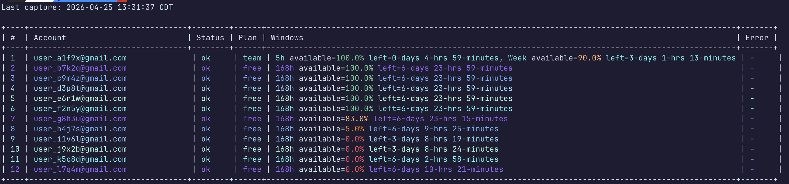
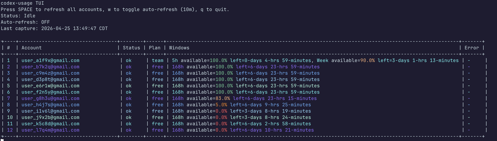

# codex-usage

`codex-usage` is a Python CLI for tracking OpenAI Codex usage across multiple OAuth-authenticated accounts.

It supports:
- adding/re-authenticating accounts with browser-based OAuth
- showing usage for all known accounts in a colorized table
- a live TUI mode with threaded refreshes
- optional raw API debug dumps


## Requirements

- Python 3.10+

## Install / Run


```bash
./codex-usage.py --help
```


## Commands

The CLI has three modes:
- `--add-account`
- `--show-usage`
- `--tui` (interactive usage mode; no extra mode flag required)

### Add an account

```bash
./codex-usage.py --add-account
```

Flow:
1. Generates an OpenAI OAuth URL and opens it in your browser.
2. You sign in and copy the callback URL/code.
3. CLI exchanges the code for OAuth tokens.
4. Account is inserted/updated in local `auth.json`.

Useful options:
- `--no-open`: do not auto-open browser
- `--auth-file <path>`: custom auth store path (default lookup: `./auth.json`, otherwise `~/.config/codex-usage/auth.json`)
- `--json`: save full authentication session output to `./json/YYYYMMDD-HH24MMSS--account--auth.json`
- `--debug`: dump raw OAuth responses to `stderr`

### Show usage (one-shot)

```bash
./codex-usage.py --show-usage
```



Output behavior:
- account refresh calls run in parallel threads
- table sorted by:
  1. available percentage descending
  2. time left ascending
  3. account label ascending
- rows are numbered
- line coloring per account row
- percentage coloring:
  - `0%` red
  - `100%` green
  - `>= 50%` yellow
  - `< 50%` orange
- single `Last capture:` timestamp above the table (when the refresh cycle completed)
- time-left values are printed as relative durations (`n-days n-hrs n-minutes`) in console output

Useful options:
- `--json`: prints machine-readable output and saves per-account API snapshots to `./json/YYYYMMDD-HH24MMSS--account.json`
- `--debug`: dump raw usage/OAuth responses to `stderr`
- `--timeout <seconds>`: request timeout (default: `20`)

Notes:
- With `--json`, one-shot mode writes snapshot files and does not print JSON payloads to `stdout`.
- JSON output keeps raw API-compatible values and does not apply console coloring/relative formatting.
- JSON snapshot files include API payload sections for usage, OAuth refresh, and OAuth exchange during `--add-account`.
- Auth snapshot files use `./json/YYYYMMDD-HH24MMSS--account--auth.json`; if identity is unknown, `account` becomes `unknown`.
- Snapshot files contain highly sensitive values (authorization codes, access/refresh tokens, account metadata). Do not share or commit these files.

### TUI mode

```bash
./codex-usage.py --tui
```



Behavior:
- renders full table
- refreshes all accounts in parallel threads
- updates display as each account completes
- `--tui` does not require `--show-usage`

Keys:
- `SPACE`: refresh now
- `w`: toggle auto-refresh every 10 minutes
- `q`: quit

Notes:
- `--json` can be combined with TUI and will write snapshot files for each refresh cycle
- if terminal is not interactive, tool falls back to normal `--show-usage` text output

## Data storage

By default credentials are stored in:
- `./auth.json` if present
- otherwise `~/.config/codex-usage/auth.json`

Example structure:

```json
{
  "version": 1,
  "accounts": [
    {
      "account_id": "acct_...",
      "email": "user@example.com",
      "display_name": "user@example.com",
      "subject": "user_...",
      "access_token": "...",
      "refresh_token": "...",
      "expires_at": "2026-04-25T03:00:00Z",
      "created_at": "2026-04-25T01:00:00Z",
      "updated_at": "2026-04-25T02:00:00Z"
    }
  ]
}
```

Security notes:
- file is written with restrictive permissions (`0600`)
- values are still plaintext tokens on disk
- treat your auth store file as a secret

## Debug output

When `--debug` is enabled, raw API response bodies are printed to `stderr` for:
- OAuth token exchange
- OAuth token refresh
- usage API requests

This can expose sensitive data (including token payloads and account metadata). Use carefully.

## API endpoints used

OAuth:
- `https://auth.openai.com/oauth/authorize`
- `https://auth.openai.com/oauth/token`

Usage:
- `https://chatgpt.com/backend-api/wham/usage`

## Development

Run tests:

```bash
uv run --extra dev pytest -q
```

Current package version is defined in:
- `pyproject.toml`
- `src/codex_usage/__init__.py`

For release notes and version-by-version change details, see `HISTORY.md`.
